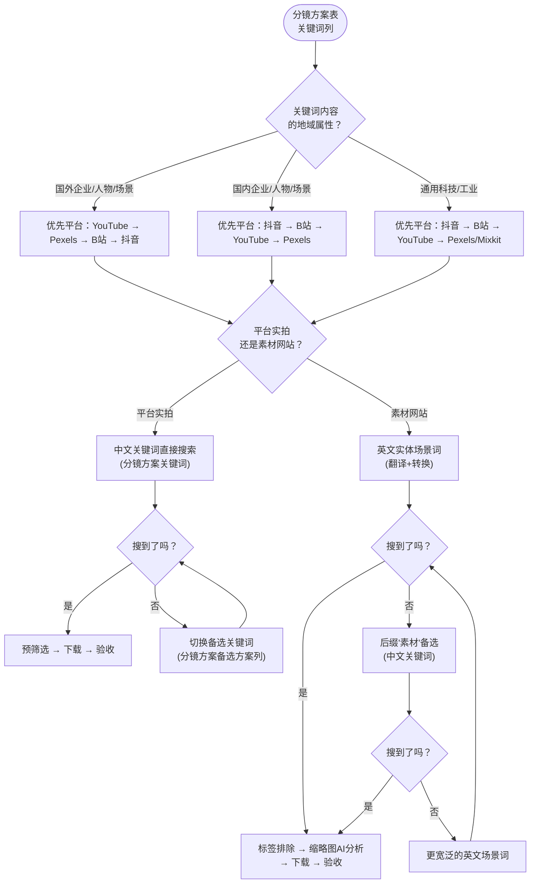
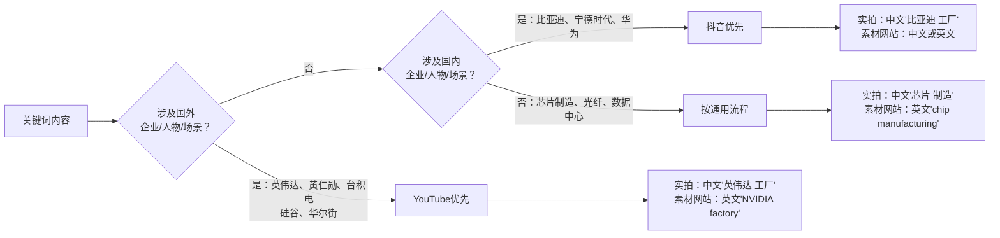
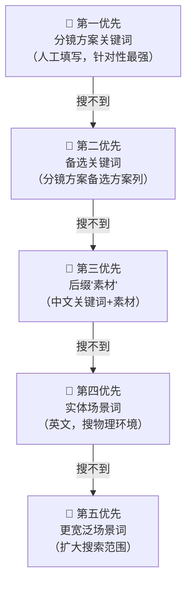
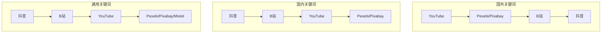
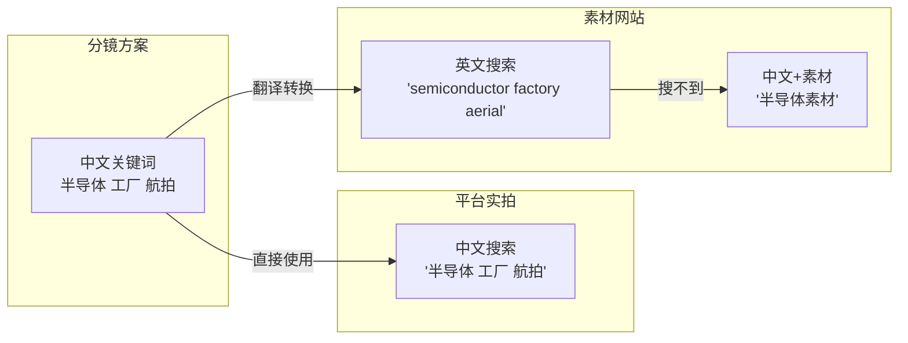
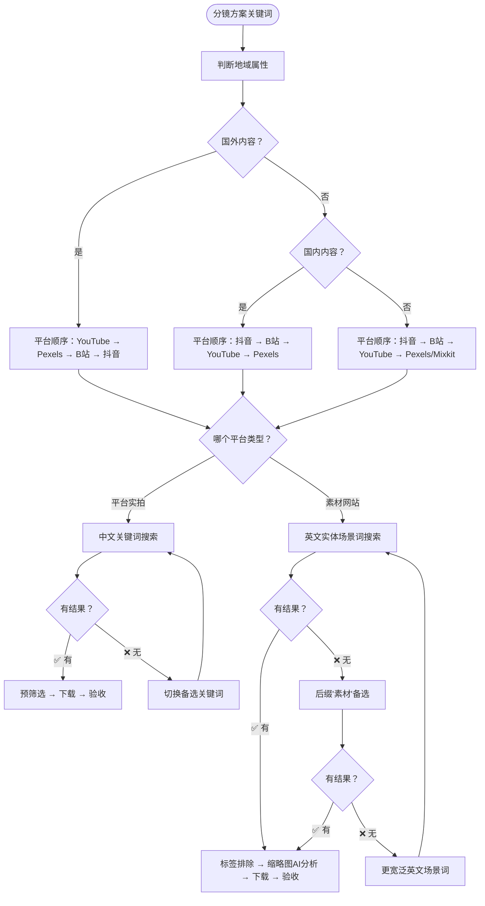

# 关键词编辑策略逻辑架构

> 本文档用 Mermaid 图展示宝哥视频项目中关键词从分镜方案到各平台搜索的完整决策流程。

## 一、总体决策流程

## 二、关键词地域判断树

## 三、关键词备选层级（降级路径）

## 四、平台搜索顺序（按地域）

## 五、关键词语言映射

## 六、完整决策树（含所有分支）

---

> 本图对应的完整规则文档：`references/keyword-rules.md`
